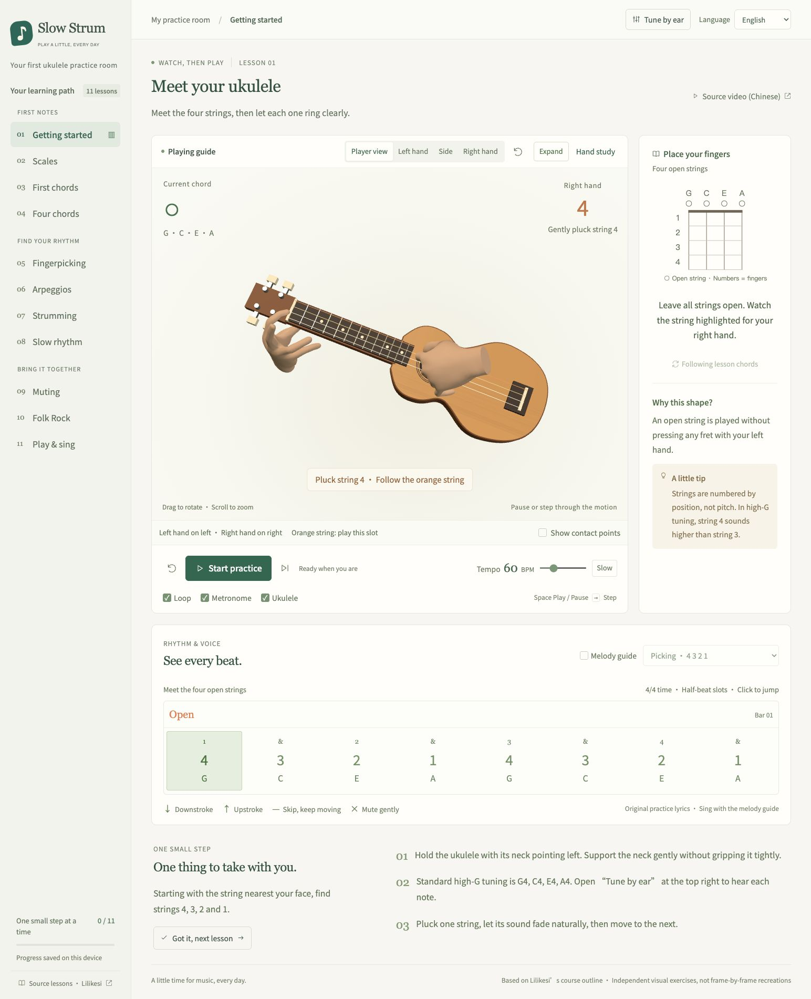

# Slow Strum · 慢慢弹

A gentle ukulele practice room for beginners. Watch the fingers on a 3D ukulele,
follow each beat, and learn at your own pace. English by default, with Simplified Chinese available throughout.

[Open the practice room](https://slow-strum.htrw24sw7s.workers.dev) · [中文说明](README.zh-CN.md)



## Practise a little, every day

- Eleven guided lessons: open strings, tuning, scales, chord changes, fingerpicking,
  arpeggios, strumming, muting and singing.
- C, Am, F, G and G7 shapes with animated hand placement, plus a C major scale.
- Player-oriented, left-hand, right-hand and side views; drag, zoom or expand the guide.
- Synthesized ukulele notes, reference tuning tones, a metronome and a melody guide.
- 40–120 BPM, count-in, pause, half-beat stepping, looping and single-chord practice.
- English and Chinese instructions and lyrics. Switching language keeps your
  position and practice settings; learning progress stays on your device.
- A separate frame-by-frame [hand study](https://slow-strum.htrw24sw7s.workers.dev/hand-study.html).

No account, microphone, backend or database is required. The view is a teaching
illustration, not a literal eye-position camera or an assessment of your playing.

## Run locally

Use Node.js 22.12+ and npm.

```sh
npm ci
npm run dev
```

Open the address printed in the terminal, usually http://127.0.0.1:5173/.
On macOS, you can also use `启动练习室.command` after installing Node.js.

```sh
npm test
npm run build
npm run preview
```

Serve `dist/` over HTTP; do not open the HTML files directly from disk.
The model assets are bundled. The site can use system fonts if Google Fonts is unavailable.

## Deploy to Cloudflare

This is an assets-only Cloudflare Worker. Cloudflare serves the home page and redirects `.html` links to clean URLs.
The hand study supports both local `.html` and deployed extensionless routes.

```sh
npx wrangler login
npm run deploy
```

When deploying your own copy, choose a unique `name` in `wrangler.jsonc`.
Use your own Cloudflare login or a `CLOUDFLARE_API_TOKEN` in your deployment
environment. Never commit credentials. Deployment is manual; pushing to GitHub
does not automatically publish a new version.

## Project map

- `src/studio.js` — lesson UI and playback coordination
- `src/data.js` — lessons, chords, patterns and original practice lyrics
- `src/model.js`, `src/course-hands.js` — instrument and animated hands
- `src/hand-motion.js`, `src/playing-view.js` — transitions and camera views
- `src/audio.js` — synthesized sounds
- `src/i18n.js`, `src/locales/en.js` — language selection and translations
- `src/practice-session.js` — settings retained during a language change
- `public/models/` — meshes, poses and their original license
- `tests/` — motion, timing and localization checks

Use `?lang=en` or `?lang=zh-CN` to open a specific language. English practice
lines contain eight one-syllable words, matched to the eight half-beat slots.

## Contributing

Small, focused improvements are welcome. Run `npm test` and `npm run build`,
and check the result in both languages at desktop and narrow widths. For hand
animation changes, inspect the actual motion; passing numerical checks alone
does not establish a natural playing posture.

## Credits and license

MIT licensed. See [LICENSE](LICENSE) and [third-party notices](THIRD_PARTY_NOTICES.md).
Hand models derive from the MIT-licensed WebXR generic hand assets, with the
original copyright notice retained alongside them.

The [reference course](https://www.bilibili.com/video/BV1st411q7yc) is in Chinese.
Videos and source songs are not redistributed or licensed by this project.
The exercises and short lyrics here are independently written. Audio uses
synthesized notes rather than recorded vocals. Hand motions have not been
individually reviewed by a music teacher.
